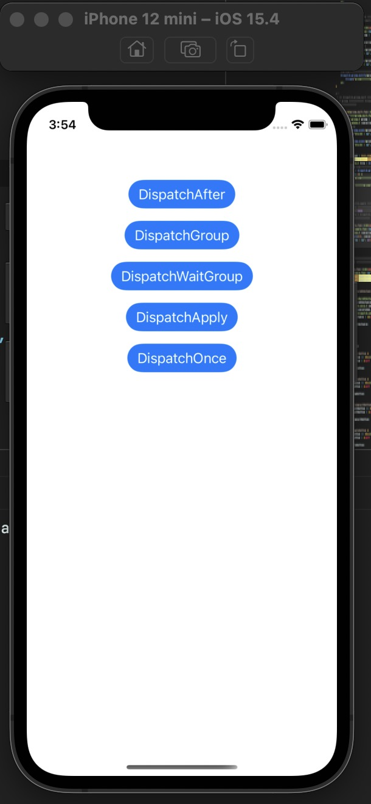
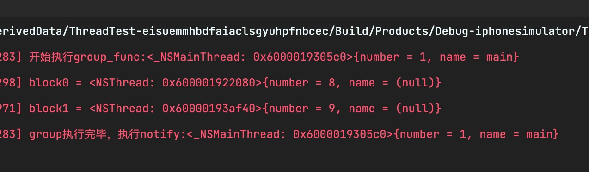

# GCD多线程接口样例

## 简介

主要包含GCD中以下接口：

- dispatch_after
- dispatch_group
- dispatch_group_wait
- dispatch_apply
- dispatch_once

## 使用

先下载当前项目

```
git clone https://github.com/cnatom/GCDThreadExample
```

在项目根目录，执行以下命令，安装依赖包

```
pod install
```

打开`ThreadTest.xcworkspace`，编译运行效果如下：



点击按钮即可执行演示函数：



## 第三方库

- Masonry：https://github.com/SnapKit/Masonry